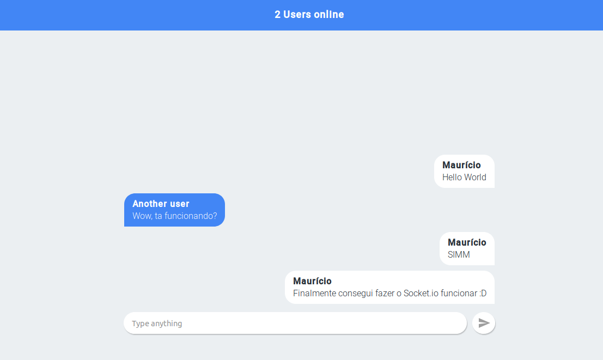

<h1 align="center">realtime-chat :speech_balloon: </h1>
<p align="center">A realtime chat using React, Node and Socket.io </p>

<p align="center">
  <a href="https://github.com/mauriciomutte/realtime-chat/issues"></a>
  <a href="https://github.com/mauriciomutte/realtime-chat/blob/master/LICENSE"></a>
  <a href="https://twitter.com/mauriciomutte/status/1156694145370640384"></a>
</p>


<p align="center">
  
</p>

<p align="center">
  <a align="center" href="https://chat.mauriciomutte.now.sh/">View demo</a>
</p>

# Getting started

1. Fork this repository on GitHub.
2. Clone *your forked repository* with `git clone https://github.com/YOURUSERNAME/realtime-chat.git`
3. `cd realtime-chat`
4. Install dependencies and start:

```shell
# Install dependencies:
$ yarn

# Start projects:
$ yarn start
```

# Build with

## Front-end

[ReactJS](https://reactjs.org/)<br/>

[Styled-components](https://www.styled-components.com/)<br/>

## Back-end

[Node.js](https://www.styled-components.com/)<br/>

[Express](https://expressjs.com/)<br/>

[Socket.io](https://socket.io/)<br/>
